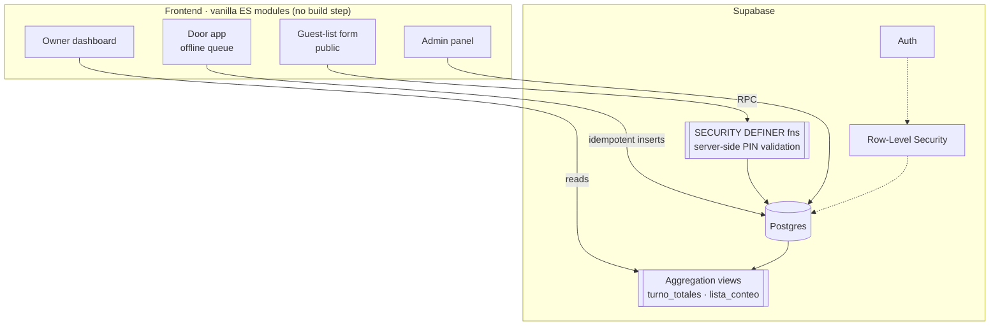

# 303 — Nightclub operations & analytics platform

A production-oriented system for a Barcelona nightclub that captures **real-time door
attendance** and cross-references it with **bar revenue** to give the owner reliable business
metrics — replacing a manual spreadsheet with live, reconciled data.

Built as a lightweight, buildless web platform (vanilla ES modules) on top of **Supabase**
(Postgres + Auth + Row-Level Security), designed to run offline at the door and scale to
multiple venues.

**Live:** https://leandrocrocco.github.io/303/ · **Stack:** JavaScript (ES modules) · Supabase · PostgreSQL · Chart.js

---

## The problem

The venue tracked the night on paper: cash at the door divided by ticket price to *estimate*
attendance, bar totals from a Revolut terminal, and payouts to each promoter (a % of door and
bar) worked out by hand at the end of the night. Attendance was never really measured, cash
reconciliation was manual, and the owner had no month-over-month view.

**303 turns that into a system:** every guest is counted with a tap, cash is reconciled at
close, and the owner sees net revenue, per-guest value, promoter performance and cash integrity
per night — automatically.

## The four apps

| App | User | Purpose |
|-----|------|---------|
| **`puerta/`** (Door) | Doorman | Tap-to-count entry, offline queue, guest-list check-in, cash count & shift close |
| **`lista/`** (Guest list) | Promoters | Public, login-free form to load guest names (server-side PIN attribution) |
| **`admin/`** | Operator | Schedule nights, manage promoters & payout %, enter bar revenue |
| **`dashboard/`** | Owner | 5-tab analytics: overview, promoters, nights, door, bar |

## Architecture



Everything is served as static files from GitHub Pages; Supabase is the only backend.

## Engineering highlights

These are the decisions that make it robust rather than a demo:

- **Offline-first door counting.** Taps are optimistic in the UI and queued in IndexedDB
  (`shared/queue.js`); each record carries a client-generated UUID so retries are **idempotent**
  (no double counts when connectivity flaps). `ingresos` is append-only — no sync conflicts.
- **Server-side aggregation to dodge silent truncation.** The Supabase REST API caps at 1000
  rows and would silently truncate sums once the venue accrued a few months of entries. All
  aggregation happens **inside Postgres** via views (`turno_totales`, `lista_conteo`), created
  with `security_invoker = true` so they never bypass RLS.
- **Login-free guest list, secured at the DB.** Promoters use a public link with no account.
  PINs are validated by `SECURITY DEFINER` functions so they never reach the browser and `anon`
  can't insert arbitrary rows — only through the vetted RPC.
- **A database-level lock prevents double entry.** Marking a guest as arrived is a conditional
  `UPDATE ... WHERE entro = false`; a second tap matches zero rows and is rejected — safe even
  with two doormen hitting the same name at once.
- **Cash integrity ("is money missing?").** At close the doorman counts the till; the app already
  knows expected cash from non-online tickets + coat check, and surfaces the variance per night
  and per doorman.
- **Multi-tenant from day one.** `usuarios_clientes` + RLS scope every read/write by venue, so
  the same deployment replicates to other clubs.
- **Timezone-correct dates.** "Today" is always computed from local date components, never UTC
  slicing — a real bug that shifted the business date during Barcelona's early-morning hours.

## Data model (core)

- **`turnos`** — a shift/night: `programado → activo → cerrado`, with cash reconciliation fields.
- **`ingresos`** — one row per real entry (tap): free / paid ticket / online (RA) / coat check.
  Source of truth for all counts.
- **`lista`** — guest names per night, with an `entro` flag flipped on check-in.
- **`productoras`** — promoters, with per-promoter payout split (`pct_puerta`, `pct_barra`).
- Schema and full migration history live in [`db/`](db/).

`net_to_venue = door × (1 − pct_puerta) + bar × (1 − pct_barra)`

## Tech stack

- **Frontend:** vanilla JavaScript (ES modules), no framework, no build step. Chart.js for viz.
- **Backend:** Supabase — PostgreSQL, Auth, Row-Level Security, SQL views & `SECURITY DEFINER`
  functions.
- **Offline:** IndexedDB queue with idempotent upserts.
- **Hosting:** GitHub Pages (static) + Supabase (managed Postgres).

## Project structure

```
303/
├── puerta/      Door app (doorman)
├── lista/       Public guest-list form (promoters)
├── admin/       Admin panel (operator)
├── dashboard/   Owner analytics (5 tabs)
├── shared/      Supabase client, config, offline queue
├── db/          schema.sql · migrations/ · demo seed
└── index.html   Landing
```

Each app follows the same shape: a thin `index.html`, an `app.js` orchestrator, and a `data.js`
data layer that is the only thing that talks to Supabase. The dashboard splits further into
`tabs/*.js` modules with a small `render()` / `wire()` contract, so a new tab is added without
touching the others.

## Running it

The frontend is static — open `index.html` or serve the folder. It expects a Supabase project
with the schema in [`db/schema.sql`](db/schema.sql) applied (migrations in
[`db/migrations/`](db/migrations/), in order) and the connection set in
[`shared/config.js`](shared/config.js). [`db/seed_303_demo.sql`](db/seed_303_demo.sql) generates
several months of realistic demo history to populate the dashboard.

> The Supabase anon key in `shared/config.js` is a **publishable** key, safe to expose — all
> access is gated by Row-Level Security, not by keeping the key secret.

## Roadmap

- Revolut import for real bar revenue (replacing manual entry) with hour-based night matching
  (`noche_303()` already in place).
- Per-bill-denomination cash count and bar-side variance.
- Attendance ground-truth validation and configurable multi-language for other venues.

## Author

Built by **Leandro** — self-taught developer focused on operations & automation.
Feedback and questions welcome.
